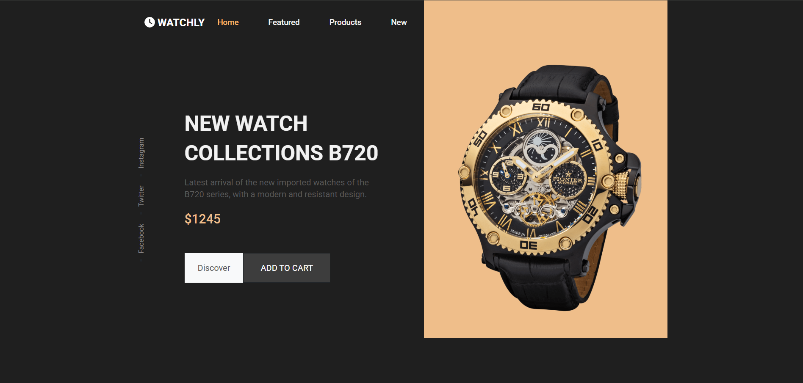
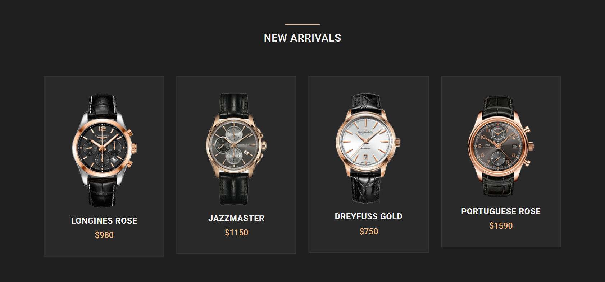
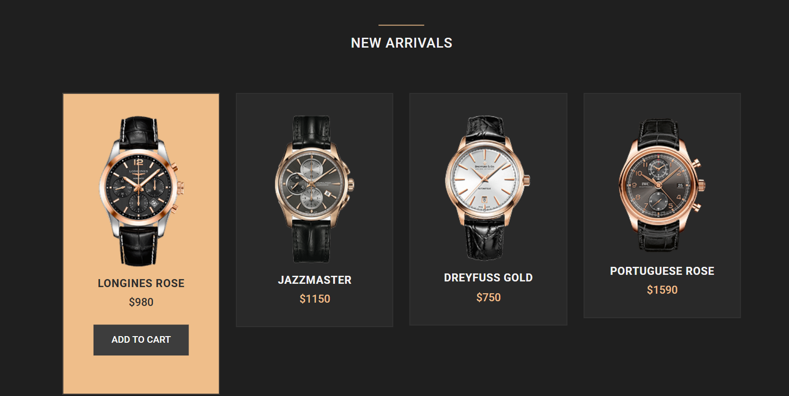
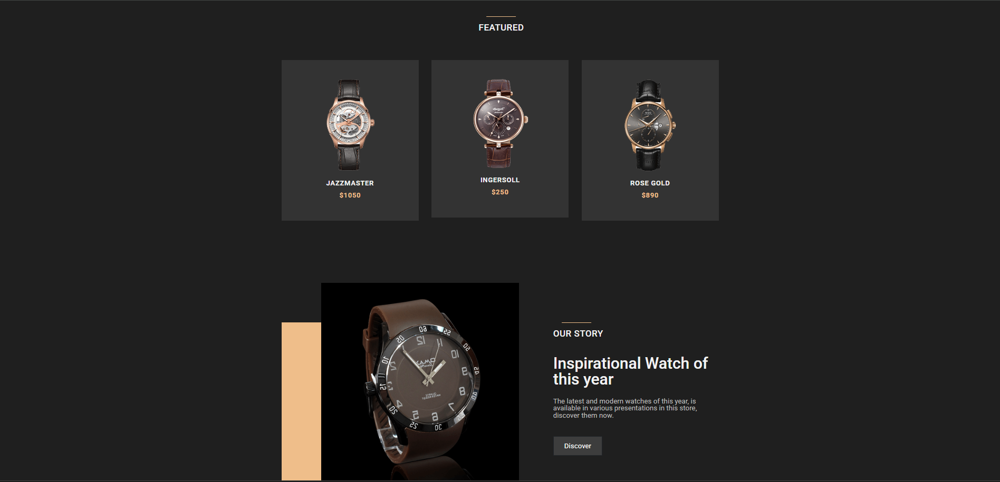
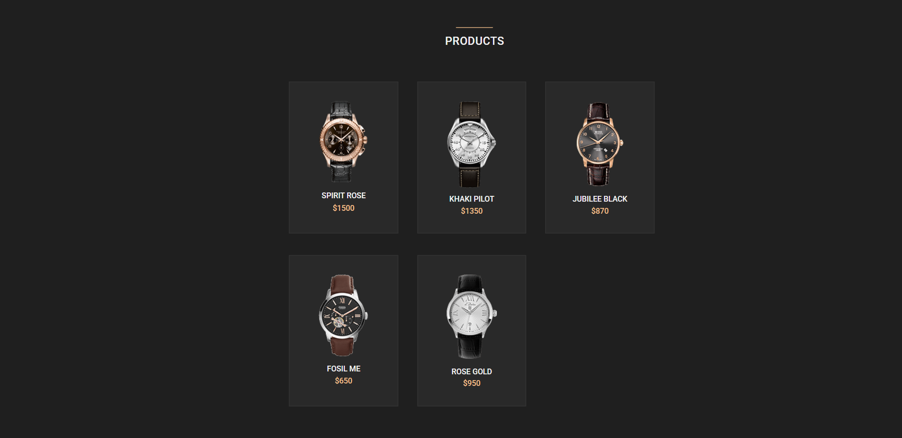
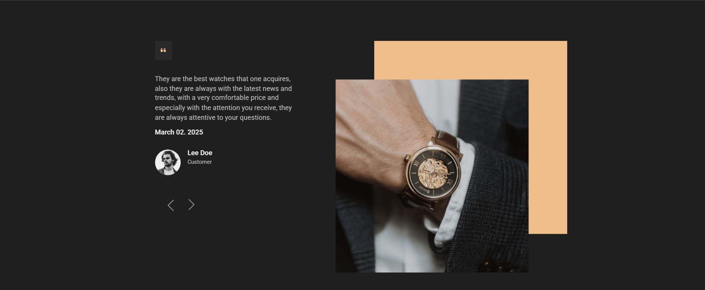
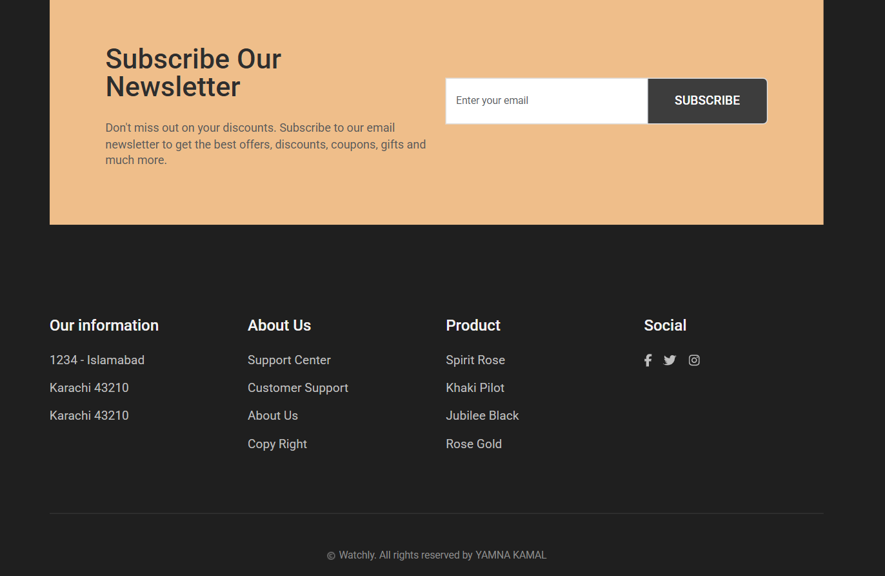

# 🕐 Watchly

Watchly is a responsive watch e-commerce website that allows users to explore a curated collection of watches, view product details, and simulate the ordering process. Built using HTML, CSS, and JavaScript.

---

## 📌 About the Project

Watchly is a frontend e-commerce watch store built using **HTML**, **CSS**, and **JavaScript**. Users can explore a curated collection of luxury watches, view product details, browse new arrivals and featured picks, and simulate the ordering experience — all within a clean, dark-themed UI.

---

## 🖼️ Screenshots

### 🏠 Homepage

> Hero section featuring the B720 collection with navigation, social links, price, and CTA buttons.

---

### 🆕 New Arrivals

> Four-card grid showcasing the latest watch additions with name and price.

---

### 🛒 Add to Cart Interaction

> Hover state on a product card reveals the "Add to Cart" button with a warm highlight effect.

---

### ⭐ Featured Products

> Featured section with a 3-column grid and an "Our Story" promo block below.

---

### 🛍️ Products Catalog

> Full product grid with 5 watches including Spirit Rose, Khaki Pilot, Jubilee Black, Fosil Me, and Rose Gold.

---

### 💬 Customer Reviews

> Testimonial slider with customer quote, date, avatar, and a decorative watch photo with a peach accent block.

---

### 📬 Newsletter & Footer

> Newsletter subscription banner followed by a four-column footer with address, links, product list, and social icons.

---

## ✨ Features

- 🏠 **Home Page** — Attractive landing page showcasing featured watches
- 🛍️ **Product Catalog** — Browse a collection of watches with images and details
- 🛒 **Order System (UI Simulation)** — Users can select and add their desired watch to cart
- 🆕 **New Arrivals Section** — Dedicated grid for the latest watch additions
- ⭐ **Featured Section** — Curated picks with an "Our Story" brand section
- 💬 **Customer Reviews Slider** — Testimonials with navigation arrows
- 📬 **Newsletter Signup** — Email subscription banner
- 📄 **Product Detail Pages** — View specifications and pricing for each watch
- 📱 **Responsive Design** — Optimized for both desktop and mobile screens

---

## 🛠️ Tech Stack

| Technology | Usage |
|---|---|
| HTML5 | Page structure |
| CSS3 | Styling & layout |
| JavaScript | Interactivity & logic |
| Bootstrap | Responsive UI components |
| jQuery 3.7.1 | DOM manipulation |
| HelveticaNeue (woff/woff2) | Custom web typography |

---

## 📁 Folder Structure

```
watchly/
├── index.html                        # Main entry point
├── html/                             # Additional HTML pages
├── css/                              # Stylesheets
├── js/
│   ├── custom.js                     # Custom project logic
│   ├── all.min.js                    # Bundled icons/utilities
│   ├── bootstrap.bundle.min.js       # Bootstrap JS
│   └── jquery-3.7.1.min.js          # jQuery library
├── images/                           # Watch images & assets
├── screenshots/                      # README preview screenshots
├── fonts/                            # Font files
└── webfonts/
    ├── HelveticaNeue-Roman.woff2
    ├── HelveticaNeue-Thin.woff2
    ├── HelveticaNeue-UltraLight.woff2
    ├── HelveticaNeue-MediumItalic.woff2
    └── stylesheet.css                # Web font declarations
```

---

## 🚀 Getting Started

1. **Clone the repository**
   ```bash
   git clone https://github.com/yamnakamal19-tech/watchly.git
   ```

2. **Open the project**
   ```bash
   cd watchly
   ```

3. **Run it** — Simply open `index.html` in your browser — no installations required!

---

© Watchly. All rights reserved by **Yamna Kamal**
